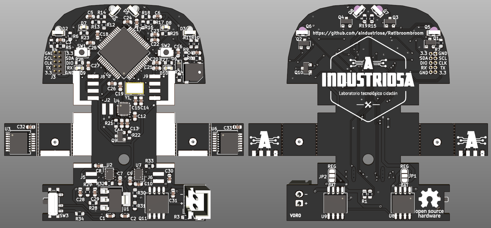

# Ratibroombroom

This repository contains de design files for the electronics part of Ratibroombroom, a maze solving robot designed at [A industriosa](https://aindustriosa.org/).

The board includes an STM32F405RGT6 microcontroller and two DRV8835 H-bridge drivers moving two 610 coreless motors for locomotion. The robot will also include a suction fan mounted on top with another 610 coreless motor driven directly with an IRLML6344 mosfet.

In the sensing aspect, the robot includes four SFH4045N IR LEDs paired with four PT12-21B/TR8 IR photodiodes for wall detection and positioning inside the maze. AS5145B magnetic encoders are used to measure motor movement precisely. The robot includes an MPU9250 9 axis IMU.

For HMI, we included two tactile switches, four LEDs and a buzzer. We are also working in an external OLED display that could be mounted in a separate module.

>THIS IS A WORK IN PROGRESS AND WILL BE UPDATED AS WE ADVANCE IN THE DEVELOPMENT

## Software

The software for this robot will be available in the following repository: [https://github.com/aindustriosa/RatibroombroomSW/](https://github.com/aindustriosa/RatibroombroomSW/)

## Pinout 

Pin # | Function | Peripheral |
----|----|----|
2 | PC13 | Right button (SW2) | 
8 | PC0 | Receiver front right (Q6)  | 
9 | PC1 | Receiver side right (Q8) | 
10 | PC2 | Receiver side left (Q7) | 
11 | PC3 | Receiver front left (Q5) | 
14 | PA0 | LED front left (D7) | 
15 | PA1 | LED front right (D8) | 
16 | PA2 | LED back left (D9)  | 
17 | PA3 | LED back right (D10) | 
20 | PA4 | Emitter front right (D3) | 
21 | PA5 | Emitter side right (D5) | 
22 | PA6 | Emitter side left (D4) | 
23 | PA7 | Emitter front left (D2) | 
24 | PC4 | Battery voltage measurement | 
29 | PB10 | I2C SCL (J3) | 
30 | PB11 | I2C SDA (J3) | 
33 | PB12 | Left button (SW1) |  
35 | PB14 | IMU FSYNC (U4) | 
36 | PB15 | IMU INT (U4) | 
37 | PC6 | Right motor direction (U7) | 
38 | PC7 | Right motor PWM (U7) | 
39 | PC8 | Left motor direction (U2) | 
40 | PC9 | Left motor PWM (U2) | 
42 | PA9 | Serial RX (J3) | 
43 | PA10 | Serial TX (J3) | 
46 | PA13 | SWDIO (J3) | 
49 | PA14 | SWCLK (J3) | 
50 | PA15 | IMU CS (U4) | 
51 | PC10 | IMU SCK (U4) | 
52 | PC11 | IMU MISO (U4) | 
53 | PC12 | IMU MOSI (U4) | 
56 | PB4 | Encoder left, channel A | 
57 | PB5 | Encoder left, channel B | 
58 | PB6 | Encoder right, channel B | 
59 | PB7 | Encoder right, channel A | 
61 | PB8 | Suction fan PWM | 
62 | PB9 | Buzzer (BZ1) | 

## References

This project is heavily based on the work of [cua-cua](https://github.com/cua-cua) and [peque](https://github.com/peque) from [Bulebots](https://github.com/Bulebots) in their projects [Bulebule](https://github.com/Bulebots/bulebule) and [Meiga](https://github.com/Bulebots/meiga)